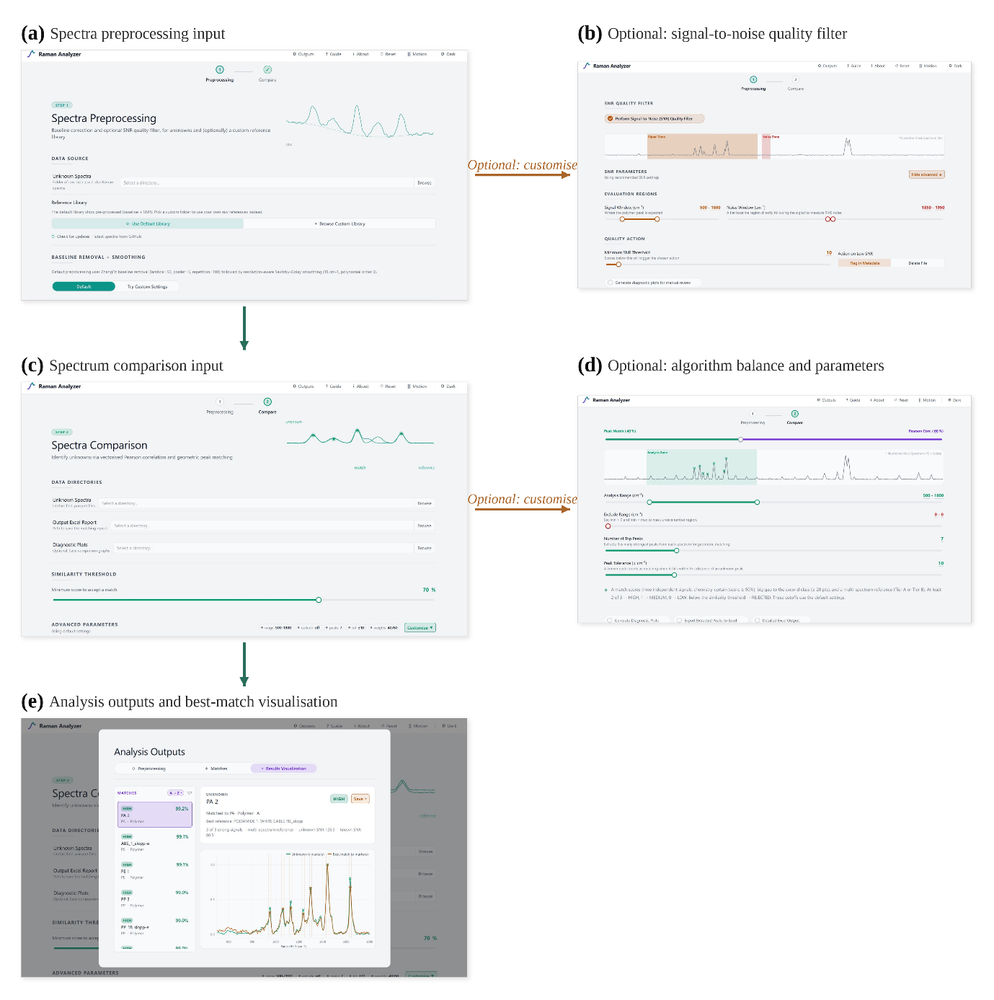

# RamanAnalyzer v1.0

<p align="center">
  
</p>

<p align="center">
  <b>Precision microplastic identification pipeline for Raman spectra preprocessing and reference-library matching</b>
</p>

<p align="center">
  <a href="https://github.com/Fuadqr/Raman-Analyzer-V1.0/releases/tag/v1.0.0">Download release</a>
  ·
  <a href="#installation">Installation</a>
  ·
  <a href="#graphical-user-interface-gui">GUI</a>
  ·
  <a href="#citation">Citation</a>
</p>

---

## Overview

**RamanAnalyzer** is an open-source Raman spectroscopy analysis workflow designed for **automated microplastic identification**. It combines spectral preprocessing, signal-to-noise ratio assessment, peak-based matching, and full-spectrum correlation to compare unknown Raman spectra against a reference library.

The tool can be used in two ways:

1. **Graphical User Interface (GUI)** — for users who prefer a Windows-based interface.
2. **Python scripts** — for reproducible batch processing and research workflows.

RamanAnalyzer is intended for high-throughput Raman spectral analysis, especially for polymer and microplastic identification, while also supporting non-polymer reference classes where included in the reference library.

---

## Main Features

- Batch Raman spectra preprocessing.
- Baseline correction using several methods:
  - ZhangFit
  - ModPoly
  - IModPoly
  - Asymmetric Least Squares (ALS)
- Savitzky-Golay smoothing.
- Range-aware signal-to-noise ratio (SNR) calculation.
- Export of processed spectra as `.parquet` files.
- Reference-library matching using:
  - peak-based matching
  - full-spectrum Pearson correlation
  - weighted combined similarity score
- Excel match-report generation.
- PNG diagnostic plots.
- Best-match plots automatically sorted into:
  - `Over_Threshold`
  - `Below_Threshold`
- `tqdm` progress bars for long batch-processing steps.
- Optional Windows executable release for GUI-based use.

---

## Repository Structure

```text
Raman-Analyzer-V1.0/
│
├── README.md
├── requirements.txt
├── CITATION.cff
├── LICENSE
│
├── docs/
│   └── images/
│       ├── RAlogo.PNG
│       └── GUI.png
│
├── V1.0_2025_Paper/
│   ├── step1_preprocess_png_only_tqdm.py
│   └── step2_match_png_only_threshold_tqdm.py
│
├── V2024/
│
└── outputs/
```

> **Note:** The latest recommended version is the **V1.0** workflow. Older folders are retained for archival and comparison purposes.

---

## Installation

If you want to run the Python scripts directly, create a virtual environment first.

### Windows

```bash
python -m venv .venv
.venv\Scripts\activate
pip install -r requirements.txt
```

### macOS/Linux

```bash
python -m venv .venv
source .venv/bin/activate
pip install -r requirements.txt
```

---

## Required Libraries

The required Python libraries are listed in `requirements.txt`:

```text
numpy
pandas
matplotlib
scipy
BaselineRemoval
joblib
tqdm
pyarrow
openpyxl
xlsxwriter
```

The scripts also use standard Python libraries such as:

```text
os, re, sys, argparse, textwrap, contextlib
```

These are included with Python and do not need to be installed separately.

---

## Workflow

The RamanAnalyzer workflow has two main steps.

---

## Step 1 — Raman Spectral Preprocessing

Step 1 reads raw Raman spectra and applies baseline correction, smoothing, and SNR calculation.

### Input formats

Step 1 supports common Raman spectral file formats, including:

- `.csv`
- `.txt`
- `.xlsx`

### Main operations

Step 1 performs:

1. Raman data loading.
2. Baseline correction.
3. Savitzky-Golay smoothing.
4. SNR calculation.
5. Export of processed spectra as `.parquet`.
6. Optional PNG diagnostic plotting.

### Example command

```bash
python V1.0_2025_Paper/step1_preprocess_png_only_tqdm.py --input path/to/raw_spectra --output path/to/processed_output
```

### Disable plots

```bash
python V1.0_2025_Paper/step1_preprocess_png_only_tqdm.py --input path/to/raw_spectra --output path/to/processed_output --no-plots
```

### Disable progress bars

```bash
python V1.0_2025_Paper/step1_preprocess_png_only_tqdm.py --input path/to/raw_spectra --output path/to/processed_output --no-tqdm
```

### Step 1 outputs

Step 1 produces:

```text
processed_output/
├── *_bs+sm.parquet
├── snr_summary.csv
└── plots/
    ├── *_preprocessing.png
    ├── *_snr.png
    └── snr_distribution.png
```

---

## Step 2 — Raman Reference Matching

Step 2 reads the processed `.parquet` spectra and compares unknown spectra against a known reference library.

### Matching approach

RamanAnalyzer combines two complementary similarity metrics:

### 1. Peak-based matching

Detected Raman peaks from the unknown spectrum are compared against peaks from reference spectra using a configurable peak-position tolerance, typically around ±10 cm⁻¹.

### 2. Full-spectrum Pearson correlation

The full processed spectra are interpolated onto a shared Raman shift grid and compared using Pearson correlation.

### 3. Combined similarity score

The final similarity score is calculated as a weighted combination of:

```text
Combined similarity = peak weight × peak score + Pearson weight × Pearson score
```

The default weighting is:

```text
Peak score weight    = 0.40
Pearson score weight = 0.60
```

### Example command

```bash
python V1.0_2025_Paper/step2_match_png_only_threshold_tqdm.py --unknown path/to/unknown_processed_parquet --known path/to/reference_library --output path/to/match_report.xlsx
```

### Disable plots

```bash
python V1.0_2025_Paper/step2_match_png_only_threshold_tqdm.py --unknown path/to/unknown_processed_parquet --known path/to/reference_library --output path/to/match_report.xlsx --no-plot
```

### Disable progress bars

```bash
python V1.0_2025_Paper/step2_match_png_only_threshold_tqdm.py --unknown path/to/unknown_processed_parquet --known path/to/reference_library --output path/to/match_report.xlsx --no-tqdm
```

### Step 2 outputs

Step 2 produces:

```text
match_report.xlsx

best_match_plots/
├── Over_Threshold/
│   └── *_best_match.png
└── Below_Threshold/
    └── *_best_match.png
```

The Excel report contains the class-level matching results, the best predicted class, SNR values, and confidence information.

---

## Graphical User Interface (GUI)

A Windows-based GUI is provided for users who prefer to run RamanAnalyzer without directly editing Python scripts.

The GUI supports:

- folder selection for known and unknown spectra
- baseline correction and smoothing
- SNR calculation
- batch preprocessing
- reference-library matching
- Excel report generation
- best-match PNG plotting
- adjustable matching parameters

<p align="center">
  
</p>

The GUI release can be downloaded from:

```text
https://github.com/Fuadqr/Raman-Analyzer-V1.0/releases/tag/v1.0.0
```

---

## Using the GUI

The GUI workflow follows the same two-step structure.

### Step 1 in the GUI

In Step 1, the user processes the reference spectra and unknown spectra separately. For each folder, the user selects:

- input folder
- output folder
- baseline correction method
- smoothing settings
- SNR settings
- plot options

This generates the processed `.parquet` spectra needed for Step 2.

### Step 2 in the GUI

In Step 2, the user selects:

- processed unknown spectra folder
- processed known/reference spectra folder
- Excel output location
- optional plot output location
- Raman shift analysis range
- peak tolerance
- number of top peaks
- similarity threshold
- peak weight
- Pearson correlation weight
- optional exclusion range

The peak weight and Pearson weight should sum to 1.0.

---

## Reference Library

The RamanAnalyzer workflow is designed to work with a structured Raman reference library containing polymer and non-polymer spectra.

The reference library may include:

- in-house curated spectra
- open reference spectra
- polymer classes
- non-polymer classes
- tiered reference folders for confidence support

The matching script automatically reads the reference-library folder structure and uses available tier metadata when present.

---

## Plotting

RamanAnalyzer saves **PNG plots only**.


### Step 1 plots

Step 1 can generate:

- baseline correction plots
- smoothing plots
- SNR diagnostic plots
- SNR distribution plot

### Step 2 plots

Step 2 can generate best-match plots showing:

- unknown and best-reference spectra
- detected peak positions
- peak matching tolerance bands
- match details
- confidence reasoning
- similarity metric bars

Best-match plots are automatically sorted into:

```text
Over_Threshold/
Below_Threshold/
```
---

## Tested Environments

This release has been tested on:

- Windows
- macOS through VMware

The Windows executable is provided for easier GUI-based use. Users who want full reproducibility or customization are encouraged to run the Python scripts directly.

---

## Acknowledgement

RamanAnalyzer was developed at the **University of Birmingham** as part of research on Raman-based microplastic identification and spectral analysis.

This work was supported by the **PlasticUnderground Doctoral Network**, funded by the **European Union’s Horizon Europe research and innovation programme** through the **Marie Skłodowska-Curie Actions Doctoral Networks (MSCA-DN)** scheme.

The views and opinions expressed are those of the author only and do not necessarily reflect those of the European Union or the granting authority.

---

## Citation

If you use RamanAnalyzer in your research, please cite the repository and the associated publication or project output.

A `CITATION.cff` file is included in this repository for citation metadata.

Suggested citation text:

```text
Alqrinawi, F. et al. (2026). RamanAnalyzer: a Raman spectra preprocessing and reference-library matching workflow for microplastic identification.
```

---

## License

Please check the `LICENSE` file for reuse conditions.

If no license is included, the code is not automatically open for reuse. For public research software, adding an open-source license such as the MIT License is recommended.

---

## Contact

For questions, issues, or suggestions, please use the GitHub Issues section of this repository.

